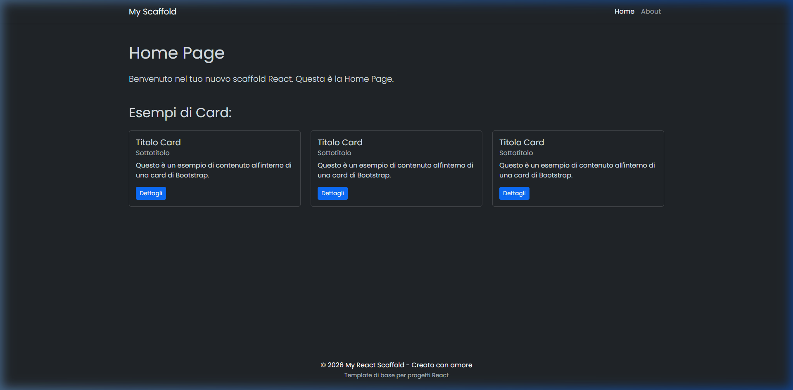

# 🚀 React Scaffold Template 



Benvenuto nel tuo nuovo scaffold professionale! Questo template è stato progettato per offrirti un punto di partenza robusto, già configurato con le migliori tecnologie moderne.

---

## 🏗️ Architettura del Progetto

-   **`src/data/`**: Contiene i file di dati statici (mock). Utile per prototipare velocemente prima di collegare un'API reale.
-   **`src/components/`**: Componenti riutilizzabili (Header, Footer, Card).
-   **`src/pages/`**: Le viste principali dell'applicazione.
-   **`src/layouts/`**: Strutture di layout comuni (es. `DefaultLayout` che include Header e Footer).
-   **`src/assets/`**: Immagini, loghi e icone.

---

## 📖 Cookbook Dettagliato

### 1. Gestione delle Rotte (Navigazione)
Il progetto utilizza `react-router-dom`. Per aggiungere una nuova sezione:

1.  **Crea la Pagina**: Crea `src/pages/NuovaPagina.jsx`.
2.  **Configura la Rotta**: In `src/App.jsx`, importa la pagina e aggiungila:
    ```jsx
    <Route path="/nuova-pagina" element={<NuovaPagina />} />
    ```
3.  **Aggiungi al Menu**: In `src/components/Header.jsx`, usa `Nav.Link`:
    ```jsx
    <Nav.Link as={NavLink} to="/nuova-pagina">Nuova Pagina</Nav.Link>
    ```

### 2. Lavorare con i Dati delle Card
Le card sono dinamiche. Per aggiungere o modificare contenuti:
1.  Apri `src/data/cards.js`.
2.  Modifica l'array di oggetti. Ogni oggetto deve avere `id`, `title`, `subtitle`, e `content`.
3.  **Dettagli Automatici**: Il sistema genera automaticamente una pagina di dettaglio all'indirizzo `/details/:id`. Non devi fare nulla manualmente per le nuove card!

### 3. Componente Card Riutilizzabile
Il componente `Card.jsx` accetta una prop `card`. Puoi personalizzarne l'aspetto in `Card.jsx` usando le classi di Bootstrap:
-   `shadow-sm`: Per un'ombra leggera.
-   `h-100`: Per far sì che tutte le card in una riga abbiano la stessa altezza.
-   `text-truncate`: Per limitare la lunghezza del testo.

### 4. Personalizzazione dello Stile (Bootstrap 5.3)
-   **Tema Dark**: Il tema scuro è attivato globalmente in `index.html` tramite `data-bs-theme="dark"`.
-   **Utility classes**: Usa le classi di Bootstrap direttamente nei tuoi componenti (es. `mt-5` per margin-top, `p-3` per padding, `text-primary` per il colore del brand).
-   **Custom CSS**: Usa `src/index.css` per stili che Bootstrap non copre (es. abbiamo aggiunto un effetto di sollevamento al passaggio del mouse sulle card).

### 5. Layout e Footer Sticky
Il `DefaultLayout.jsx` usa Flexbox per garantire che il footer rimanga sempre in fondo alla pagina (sticky footer), anche se il contenuto è scarso. Questo è gestito dalle classi:
-   `d-flex flex-column min-vh-100` sul contenitore principale.
-   `flex-fill` sull'elemento `<main>`.

---

## 🛠️ Stack Tecnologico
-   **React 19**: L'ultima versione della libreria UI.
-   **Vite**: Per uno sviluppo istantaneo e build veloci.
-   **Bootstrap 5.3 & React-Bootstrap**: Per un design reattivo senza scrivere CSS complesso.
-   **React Router 7**: Per la gestione dello stato della barra degli indirizzi.

---

## 🚀 Comandi Rapidi
-   `npm run dev`: Avvia il server di sviluppo.
-   `npm run build`: Crea la versione ottimizzata per la produzione.
-   `npm install`: Installa tutte le dipendenze necessarie.
